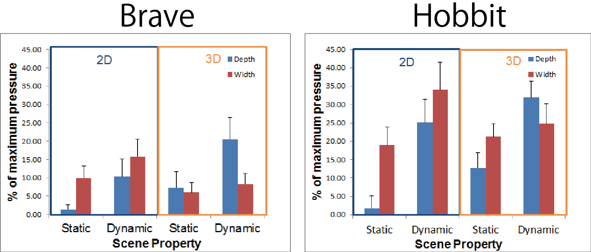

## 3D映画の臨場感
-アニメと実写の比較-

金沢工業大学情報フロンティア学部心理情報学科

伊丸岡俊秀・神宮英夫

## よくできた3D映像はヒトになんらかの影響を与える

<iframe width="560" height="315" data-src="http://www.youtube.com/embed/OiTiKOy59o4?autoplay=0&start=15&?html5=1" frameborder="0" allowfullscreen="allowfullscreen"></iframe>

## 3D映像の影響

- 映像酔い
- 疲労

- [3DC安全ガイドライン](http://www.3dc.gr.jp/jp/scmt_wg_rep/3dc_guideJ_20111031.pdf)

## 感性的な影響

 - 奥行き感
 - 臨場感
 - などなど...

## 映像の感性評価

 - IBQ法：尺度評定・一対比較・インタビュー(Hakkinen et al., 2008)
 - Visual Analog Scale(Ijsselsteinh et al. 2001)
 - __3D映像は臨場感を高める__

## ただし

- 尺度評定、インタビュー、VAS評価はいずれも映像視聴後に実施
- 視聴中の感性評価の変化は?

## 伊丸岡・神宮(2014a, b)

- 主観的臨場感をピンチ圧で表現
  - リアルタイムな測定
  - 時間的変化
- 映像の特徴に応じた臨場感上昇
- 大画面ディスプレイ仕様による臨場感上昇

## 目的

- ~~映像の物理的特性と臨場感の関係を明らかにする~~
- コンテンツ作成方法と主観的臨場感の関係<!-- .element: class="fragment roll-in" data-fragment-index="1" -->

## 一口に3D映画といっても

- 2005年から2015年まで
  - __450本__ <!-- .element: class="fragment roll-in" data-fragment-index="1" -->
- 実写 / アニメーション
  - __80% / 20%__ <!-- .element: class="fragment" roll-in data-fragment-index="2" --> 
- 3D撮影 / 3D変換
  - __60% / 40%__ <!-- .element: class="fragment" roll-in data-fragment-index="3" --> 

## 比較

- 実写映画：ホビット -思いがけない冒険-
- アニメーション映画：メリダとおそろしの森

<iframe width="448" height="252" data-src="http://www.youtube.com/embed/T1SBjAuMN6A?autoplay=0&start=15&?html5=1" frameborder="0" allowfullscreen="allowfullscreen"></iframe>

<iframe width="448" height="252" data-src="http://www.youtube.com/embed/SDnYMbYB-nU?autoplay=0&start=15&?html5=1" frameborder="0" allowfullscreen="allowfullscreen"></iframe>

## 方法

- 実験参加者: 43名
- 装置: 200インチスクリーン/液晶プロジェクタ/圧センサ
- 刺激: 2本の映画から各3チャプタ
- 実験計画
  - 3D vs. 2D / 実写 vs. アニメ いずれも参加者間比較
  - 奥行き vs. 広がり / 動的 vs. 静的 いずれも参加者内比較

## 主観評価

- ピンチ圧の強さで臨場感を表現
- 事前に測定した最大圧に対する比をデータとした

<video  class="stretch" data-autoplay data-src="./res2.m4v" autoplay></video>

## 映像の分類

- 3名に映像の特徴を分類してもらった
  - 広がり・奥行き
  - 動的・静的
- これらを条件とし、主観的臨場感の参加者間平均を算出

## 結果

- 実写 > アニメーション <!-- .element: class="fragment highlight-current-blue" roll-in data-fragment-index="1" --> 
- 広がり場面 > 奥行き場面 @ 2D呈示 <!-- .element: class="fragment highlight-current-blue" roll-in data-fragment-index="2" -->
- 3D呈示 > 2D呈示 @ 奥行き<!-- .element: class="fragment highlight-current-blue" roll-in data-fragment-index="3" -->

## 考察

1. 3D呈示の効果の強さは場面の特徴によって変わる <!-- .element: class="fragment highlight-current-red" roll-in data-fragment-index="1" --> 
   - 画角が狭く奥行き方向に物体が配置されているような場面
   - 画角が広いときには効果は大きくない
2. 2D呈示のときに臨場感を強く感じる場面もある<!-- .element: class="fragment highlight-current-red" roll-in data-fragment-index="2" --> 
   - 画角が広い場面
3. 今回用いた刺激では3D効果の現れ方にアニメ/実写の違いは見られなかった<!-- .element: class="fragment highlight-current-red" roll-in data-fragment-index="3" --> 
